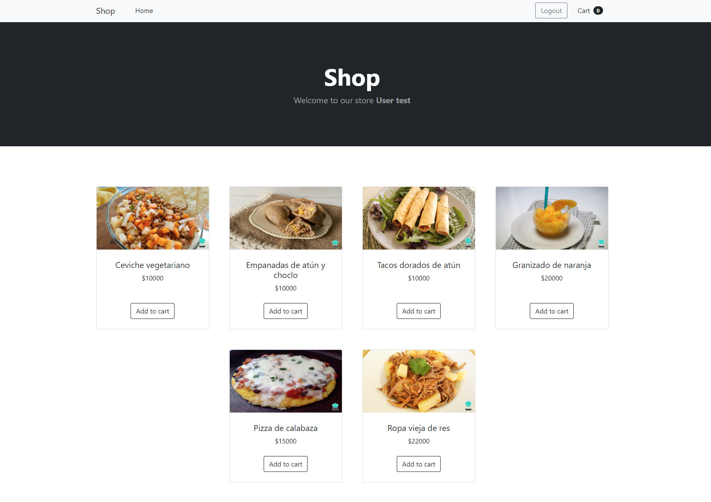

## Topics

1. [Introduction](#introduction)
2. [Requirements](#requirements)
3. [Installation & Configuration](#installation-and-configuration)
4. [License](#license)
5. [Security Vulnerabilities](#security-vulnerabilities)
6. [Miscellaneous](#miscellaneous)

### Introduction
This application was designed to show a list of different food dishes, it has the functionality of a cart in which you can add and delete products. It also has the functionality to create an order with these products.



### Requirements

- **OS**: Ubuntu 16.04 LTS or higher / Windows 7 or Higher (WampServer / XAMPP).
- **SERVER**: Apache 2 or NGINX.
- **RAM**: 4 GB or higher.
- **PHP**: 8 or higher.
- **Processor**: Clock Cycle 1 Ghz or higher.
- **For MySQL users**: 5.7.23 or higher.
- **For MariaDB users**: 10.2.7 or Higher.
- **Node**: 16.15.1 or higher.
- **Composer**: 2.3 or higher.

### Installation and Configuration

**To clone and configure run the following commands:**

```
composer install
```
1. Create a new database.
2. Copy the .env.example file content a paste it in the .env of the project.
3. Set up all project config parameters in the .env project file (database connection)
4. Run the following commands:
```
php artisan key:generate
```
```
php artisan migrate --seed
```
```
php artisan jwt:secret
```

##### Install node modules
```
npm install
```
```
npm run dev
```

##### Steps to run the tests

configure the accesses to the database for the tests in the file .env.testing and run comand

```
vendor/bin/phpunit
```

##### Postman

In the following link you will find the documentation of the services created for this project.
https://documenter.getpostman.com/view/10069404/UzXNTwyE

Note that you must first generate the token and replace it in the postman authorization, before you can use the endpoints
##### On local:

```
php artisan serve
```

### Test data:
When running the migrations, the following test user will be created and you can login with it
```
User: admin@correo.com
Password: secret
```

### TODO
1. Add alert messages
2. Add order list view

## License
The Laravel framework is open-sourced software licensed under the [MIT license](https://opensource.org/licenses/MIT).

## Security Vulnerabilities

If you discover a security vulnerability within the system, please email Daniel Romero at 123romerod@gmail.com. All security vulnerabilities will be addressed immediately. 

